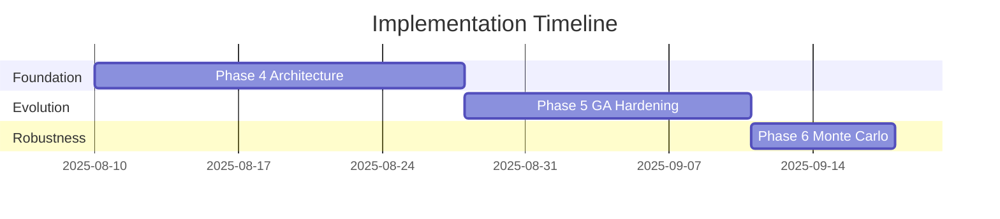

# Quantitative Trading System - Implementation Roadmap
**Generated**: 2025-08-09  
**Status**: ACTIVE  
**Total Duration**: 39 Days  

## Executive Summary

This roadmap consolidates all phase implementation plans into a unified execution strategy. The system requires systematic remediation of architectural issues before implementing advanced genetic algorithm features and robustness testing.

## Implementation Phases Overview



## Phase Dependencies

```
Phase 4 (Architecture) → Phase 5 (GA Enhancement) → Phase 6 (Monte Carlo)
         ↓                        ↓                         ↓
   [Must Complete]          [Requires Phase 4]      [Requires Phase 5]
```

## Phase 4: System Architecture Remediation (Days 1-18)
**File**: `phase4_system_architecture_remediation_plan.md`  
**Priority**: CRITICAL - Blocks all other work

### Critical Fixes
1. **Dependency Injection** (Days 1-3)
   - Fix FearGreedClient session management
   - Centralize dependency container
   - Eliminate resource leaks

2. **GA Initialization** (Days 4-6)
   - Fix HierarchicalGAOrchestrator initialization
   - Add crypto-safe parameter validation
   - Implement proper DEAP integration

3. **Overfitting Prevention** (Days 7-10)
   - Add walk-forward validation
   - Implement out-of-sample testing
   - Fix data leakage issues

4. **Architecture Cleanup** (Days 11-13)
   - Standardize imports across 173 files
   - Fix circular dependencies
   - Implement consistent patterns

5. **Performance** (Days 14-15)
   - Reduce test execution from 108s to 30s
   - Add parallel processing
   - Optimize imports

6. **Production Safeguards** (Days 16-18)
   - Add circuit breakers
   - Implement health checks
   - Add comprehensive logging

### Success Criteria
- ✅ All tests pass in < 30 seconds
- ✅ Zero import errors
- ✅ FearGreedClient properly injected
- ✅ Positive out-of-sample Sharpe ratios

## Phase 5: Genetic Algorithm Production Hardening (Days 19-32)
**File**: `phase5_genetic_algorithm_production_hardening.md`  
**Priority**: HIGH - Required for profitable strategies

### Key Implementations
1. **Seed Control** (Days 19-20)
   - Global seed management
   - Worker-specific seeds
   - 100% reproducibility

2. **Island Model** (Days 21-23)
   - 16 parallel populations
   - Migration every 3 generations
   - Diversity preservation

3. **Pareto Frontier** (Days 24-25)
   - Multi-objective optimization
   - Hypervolume tracking
   - Trade-off analysis

4. **Dynamic Stopping** (Days 26-27)
   - Adaptive termination
   - Frontier growth tracking
   - CPU budget management

5. **Walk-Forward** (Days 28-29)
   - 12 validation windows
   - Stability metrics
   - Temporal robustness

6. **Production Gate** (Days 30-32)
   - Data-driven criteria
   - No arbitrary thresholds
   - Correlation checks

### Success Criteria
- ✅ Strategy diversity > 0.3
- ✅ Out-of-sample Sharpe > 1.2
- ✅ Walk-forward tau > 0.5
- ✅ Hypervolume growth > 0.01/generation

## Phase 6: Monte Carlo Robustness (Days 33-39)
**File**: `phase6_monte_carlo_robustness_implementation.md`  
**Priority**: CRITICAL - Required for production safety

### Core Components
1. **Monte Carlo Engine** (Days 33-34)
   - 1000 scenario generation
   - Market perturbations
   - Parallel simulation

2. **Regime Testing** (Days 35-36)
   - 6 market regimes
   - Transition testing
   - Regime performance

3. **Confidence Intervals** (Day 37)
   - Bootstrap sampling
   - 95% and 99% CI
   - Statistical validation

4. **Integration** (Days 38-39)
   - Triple validation enhancement
   - Production gate update
   - CLI parameters

### Success Criteria
- ✅ 5th percentile Sharpe > 0.5
- ✅ Worst drawdown < 30%
- ✅ Robustness score > 0.7
- ✅ Survives 50% of crisis scenarios

## Integrated Testing Strategy

### Unit Testing (Continuous)
- Test each component in isolation
- Mock external dependencies
- Achieve 80% code coverage

### Integration Testing (Weekly)
- Test component interactions
- Validate data flow
- Check error handling

### System Testing (End of each phase)
- Full pipeline execution
- Performance benchmarks
- Production simulation

## Risk Management

### Technical Risks
1. **Ray Cluster Issues**
   - Mitigation: Fallback to local execution
   - Detection: Health checks every 60s

2. **Memory Overflow**
   - Mitigation: Streaming data processing
   - Detection: Memory monitoring

3. **Strategy Convergence**
   - Mitigation: Island model with migration
   - Detection: Diversity metrics

### Business Risks
1. **False Positives**
   - Mitigation: Monte Carlo validation
   - Detection: Paper trading results

2. **Capital Loss**
   - Mitigation: Position limits, stop losses
   - Detection: Real-time P&L monitoring

## Automation Preservation

All phases maintain and enhance automation:

### Current Automation (Preserved)
- ✅ Automatic strategy evolution
- ✅ Automatic backtesting
- ✅ Automatic paper trading
- ✅ Automatic deployment

### Enhanced Automation (Added)
- ✅ Automatic diversity management
- ✅ Automatic stopping when converged
- ✅ Automatic regime adaptation
- ✅ Automatic robustness validation

## Success Metrics Dashboard

```python
# Key metrics to track
metrics = {
    'phase_4': {
        'test_execution_time': '< 30s',
        'import_success_rate': '100%',
        'dependency_injection': 'working'
    },
    'phase_5': {
        'strategy_diversity': '> 0.3',
        'oos_sharpe': '> 1.2',
        'walk_forward_tau': '> 0.5'
    },
    'phase_6': {
        'monte_carlo_p5_sharpe': '> 0.5',
        'worst_drawdown': '< 30%',
        'robustness_score': '> 0.7'
    }
}
```

## Go/No-Go Criteria

### Phase 4 → Phase 5
- All architectural issues resolved
- Tests passing in < 30 seconds
- No import errors

### Phase 5 → Phase 6
- Island model operational
- Pareto frontier tracking working
- Walk-forward validation implemented

### Phase 6 → Production
- Monte Carlo robustness > 0.7
- All validation gates passing
- Paper trading profitable

## Conclusion

This roadmap transforms a fragmented system with 173 files into a production-ready quantitative trading platform. The phased approach ensures each component is properly tested before building on it.

**Total Investment**: 39 days
**Expected Outcome**: Robust, profitable, automated trading system with proper safeguards

**Next Step**: Begin Phase 4 implementation immediately to unblock subsequent phases.