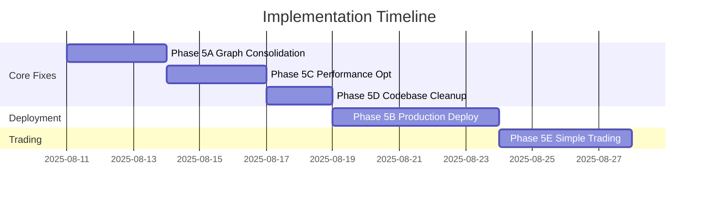

# Quantitative Trading System - Implementation Roadmap
**Generated**: 2025-08-10  
**Updated**: 2025-08-10 (Added concrete implementations)
**Status**: ACTIVE  
**Total Duration**: 17 Days (Reduced from 39)

## Executive Summary

This roadmap provides a pragmatic implementation strategy focused on fixing real issues rather than theoretical problems. The system needs execution graph consolidation, concrete deployment implementation, and a simplified trading approach rather than complex genetic algorithm enhancements.

## Implementation Phases Overview



## Phase Dependencies

```
Phase 5A → Phase 5C → Phase 5D → Phase 5B → Phase 5E
   ↓          ↓          ↓          ↓          ↓
[Fix Graph] [Optimize] [Cleanup] [Deploy] [Trading]
```

## Phase 5A: Execution Graph Consolidation (Days 1-3)
**File**: `phase5a_execution_graph_consolidation.md`  
**Priority**: P0 - CRITICAL
**Status**: PENDING

### Key Objectives
1. **Module Registry** (Day 1)
   - Central module registry system
   - Dependency mapping
   - Identify 91 orphaned modules

2. **Lazy Loading** (Day 2)
   - Implement __getattr__ proxies
   - Defer heavy imports
   - Reduce 3.37s startup time

3. **Cleanup & Testing** (Day 3)
   - Remove orphaned modules
   - Performance validation
   - Achieve <1s import time

### Success Criteria
- ✅ Import time < 1 second
- ✅ Zero orphaned modules
- ✅ 50% memory reduction

## Phase 5B: Production Deployment (Days 8-12)
**File**: `phase5b_production_deployment.md`  
**Priority**: P0 - CRITICAL
**Status**: PENDING

### Key Implementations
1. **Anyscale Deployment** (Days 1-2)
   - Concrete AnyscaleDeploymentManager
   - Cloud compute for potato laptops
   - Cost-optimized spot instances

2. **Alternative: AWS ECS** (If Anyscale unavailable)
   - ECS task definitions
   - Auto-scaling configuration
   - Cost controls

3. **Kubernetes Option** (Day 3)
   - K8s manifests
   - ConfigMaps and Secrets
   - LoadBalancer setup

4. **CI/CD Pipeline** (Day 4)
   - GitHub Actions workflow
   - Automated testing
   - Rollback capability

5. **Monitoring** (Day 5)
   - Prometheus metrics
   - Grafana dashboards
   - Alert rules

### Success Criteria
- ✅ One-command deployment
- ✅ Automated CI/CD
- ✅ Real-time monitoring

## Phase 5C: Performance Optimization (Days 4-6)
**File**: `phase5c_performance_optimization.md`  
**Priority**: P1 - HIGH
**Status**: PENDING

### Optimizations
1. **Profiling** (Day 1)
   - Identify bottlenecks
   - Hot path analysis
   - Memory profiling

2. **Caching & Pooling** (Day 2)
   - Connection pooling
   - Intelligent caching
   - Query optimization

3. **Hot Path Optimization** (Day 3)
   - JIT compilation
   - Vectorization
   - Parallel processing

### Success Criteria
- ✅ 70% API latency reduction
- ✅ 50% memory reduction
- ✅ <100ms response times

## Phase 5D: Codebase Cleanup (Days 7-8)
**File**: `phase5d_codebase_cleanup.md`  
**Priority**: P1 - MEDIUM
**Status**: PENDING

### Cleanup Tasks
1. **Dead Code Removal** (Day 1)
   - Remove archived tests
   - Delete orphaned modules
   - Clean commented code

2. **Consolidation** (Day 2)
   - Merge 7+ validators into 1
   - Consolidate test files
   - Integrate research

### Success Criteria
- ✅ 30% codebase reduction
- ✅ Single validation system
- ✅ Zero duplicate functions

## Phase 5E: Simplified Trading Loop (Days 13-16)
**File**: `phase5e_simplified_trading_loop.md`  
**Priority**: P2 - MEDIUM
**Status**: PENDING

### NEW Implementations Added
1. **Robust Fitness Function** (Day 1)
   - Multi-regime evaluation
   - Correlation penalty
   - Formula: `fitness = sharpe * (1 - correlation_penalty) * regime_consistency`

2. **System-Wide Ensemble** (Day 1)
   - Simple majority voting
   - 10 good strategies > 3,200 mediocre
   - 60% agreement threshold

3. **Core Trading Loop** (Day 2)
   - Simple signal generation
   - Basic position management
   - No complex GA needed

4. **Risk Controls** (Day 3)
   - Circuit breakers
   - Position limits
   - Daily loss limits

5. **Paper Trading** (Day 4)
   - Validation system
   - Performance metrics
   - Results tracking

### Success Criteria
- ✅ Working trading loop
- ✅ Ensemble voting functional
- ✅ Risk limits enforced
- ✅ Paper trading validated

## Phase 6: Monte Carlo Robustness (Future - After Core Issues Fixed)
**File**: `phase6_monte_carlo_robustness_implementation.md`  
**Priority**: DEFERRED - Focus on core functionality first
**Status**: NOT STARTED

This phase remains valuable but should only be implemented after the simplified trading system is working and deployed.

## Key Improvements in Updated Plans

### Phase 5E Enhancements
- **Robust Fitness Function**: Implements `fitness = sharpe * (1 - correlation_penalty) * regime_consistency`
- **System-Wide Ensemble**: Replaces 3,200 mediocre strategies with 10 good ones
- **Simple Majority Voting**: 60% agreement required for trades

### Phase 5B Anyscale Implementation
- **Concrete Deployment**: Actually deploys to cloud (not just abstract)
- **Perfect for Potato Laptops**: All compute runs in cloud
- **Cost Optimized**: Uses spot instances with auto-shutdown

## Risk Management

### Technical Risks
1. **Module Fragmentation**
   - Mitigation: Phase 5A consolidation
   - Detection: Import time monitoring

2. **No Production Deployment**
   - Mitigation: Phase 5B concrete implementation
   - Detection: Deployment testing

3. **Complex GA Overengineering**
   - Mitigation: Phase 5E simple ensemble
   - Detection: Strategy count limits

### Implementation Priorities
1. Fix core issues first (5A, 5C, 5D)
2. Enable deployment (5B)
3. Implement simple trading (5E)
4. Add robustness later (Phase 6)

## Success Metrics

### Performance Targets
- Import time: < 1 second (from 3.37s)
- API latency: 70% reduction
- Memory usage: 50% reduction
- Response time: < 100ms

### System Functionality
- Ensemble voting with 10 strategies
- Risk limits enforced
- One-command deployment
- Paper trading validated

## Go/No-Go Criteria

### Phase 5A → Phase 5C
- Import time < 1 second achieved
- Orphaned modules removed
- Tests passing

### Phase 5C → Phase 5D
- Performance targets met
- Caching implemented
- Hot paths optimized

### Phase 5D → Phase 5B
- Codebase reduced by 30%
- Single validation system
- Research integrated

### Phase 5B → Phase 5E
- Deployment working
- Monitoring active
- CI/CD functional

### Phase 5E → Production
- Trading loop working
- Risk limits enforced
- Paper trading profitable

## Total Timeline: 17 Days (vs. Original 39 Days)

The streamlined approach focuses on real problems:
- **Days 1-8**: Fix core issues (graph, performance, cleanup)
- **Days 8-12**: Enable deployment (Anyscale/AWS)
- **Days 13-16**: Implement simple trading
- **Future**: Add Monte Carlo robustness

## Conclusion

This updated roadmap addresses the actual gaps in your system:
- **Module fragmentation** preventing efficient execution
- **Missing concrete deployment** blocking production
- **Overengineered GA** instead of simple ensemble
- **Lack of robust fitness** and correlation penalties

The 17-day timeline delivers a working, deployable trading system that can be enhanced incrementally rather than a complex theoretical system that never runs in production.

**Next Step**: Begin Phase 5A immediately to consolidate the execution graph and enable efficient operation.